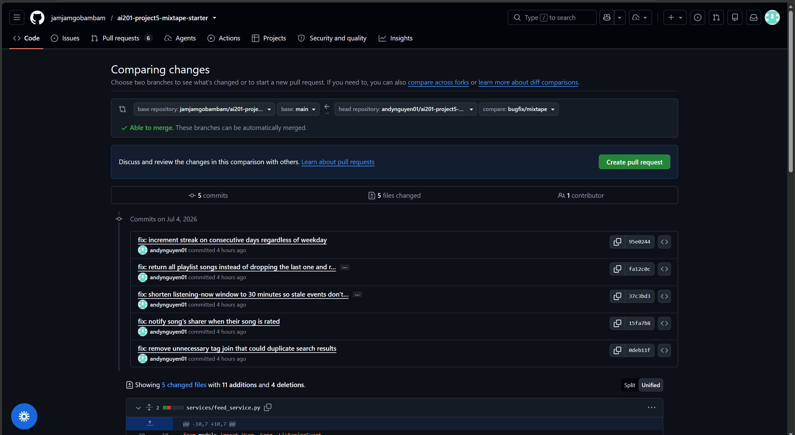

# Project 5 Submission: Mixtape Bug Hunt

## AI Usage

I used AI tools during this project mainly to help me understand the codebase and debug more efficiently. I asked AI to explain the overall route, service, and model structure, and to help trace how data moves through the app. This helped me understand that the routes are mostly thin HTTP handlers, while the service files contain the main business logic and database commits.

AI also helped me understand specific Python behavior while debugging. For example, I used it to confirm that `datetime.weekday()` returns `6` for Sunday, and I used it to review what the list slice `[:-1]` does. These details were important for understanding why the streak bug and playlist bug were happening.

For reproduction and investigation, I used AI to help plan shell commands, test commands, and Python shell checks. I also used it to compare similar code paths, especially for the notification bug where adding a song to a playlist created a notification but rating a song did not.

I did not rely on AI blindly. I verified each explanation by reading the actual code, running tests, reproducing the bugs, and checking the behavior after each fix. For Bug #3, AI first suggested that the search behavior might be fine because the tests passed, but I investigated further with a raw query and found that the SQL join still produced duplicate rows at the query level. That made me confident the join was still a real latent bug, even if SQLAlchemy was hiding the duplicate objects in the final result.

## Codebase Map

The Mixtape app is organized in three main layers: routes, services, and models.

The `routes/` folder contains the HTTP endpoints. These files handle incoming requests, read request data, call the correct service function, and return JSON responses. The routes do not contain most of the app's business logic.

The `services/` folder contains the main application logic. This is where the app creates songs, updates playlists, records listening events, updates streaks, performs searches, and creates notifications. The service layer also handles most database commits. When something goes wrong, the services often raise a `ValueError`, and then the route translates that into an HTTP response.

The `models.py` file defines the SQLAlchemy database models. The main models are `User`, `Song`, `Tag`, `ListeningEvent`, `Rating`, `Playlist`, and `Notification`. There are also association tables for many-to-many relationships. One important detail is that the playlist relationship uses a `playlist_entries` association table with a `position` column. This means playlist songs have an explicit order instead of only relying on insertion order.

The `app.py` file is the application factory. The `create_app()` function creates the Flask app and registers the blueprints. The app registers four main route groups: `/songs`, `/playlists`, `/users`, and `/feed`.

One data flow I traced was adding a song to a playlist. When a user sends a request to add a song, the route `POST /playlists/<id>/songs` calls the playlist service. The service adds the song to the playlist and updates the playlist entry position. After that, the app uses the notification service to create a notification for the original song sharer, but only when the user adding the song is not the same person who originally shared it.

A pattern I noticed is that notifications are side effects of other user actions. For example, adding a song to a playlist can also create a notification. Another pattern is that time-based features, such as listening streaks and the listening feed, are based on `ListeningEvent` rows instead of stored status flags.

## Bug Fixes and Root Cause Analysis

## Bug #1: Streak keeps resetting

Commit: `95e0244`

### How I reproduced it

I reproduced this bug by running the streak tests:

```bash
pytest tests/test_streaks.py
```

The test `test_streak_increments_on_sunday` failed. The expected streak value was `2`, but the actual value was `1`:

```text
assert 1 == 2
```

This showed that a user who listened on consecutive days did not get the streak increment when the current day was Sunday.

### How I found the root cause

I traced the listening flow from the function that records a listening event into the streak update logic. The important path was:

```text
record_listening_event -> update_listening_streak
```

The suspicious code was in `streak_service.py`. I looked at the branch that decides whether to increment the streak or reset it. The condition had a special check for Sunday, so I focused on that part.

### The root cause

The increment branch required two things:

```python
days_since_last == 1
today.weekday() != 6
```

The problem is that Python's `datetime.weekday()` returns `6` for Sunday. Because of that, when the user listened on a Sunday, the condition failed even if it was a valid consecutive listening day.

After the condition failed, the code went to the `else` branch and reset the streak to `1`. There was no project rule saying Sunday should be treated differently, so the Sunday check was incorrect.

### My fix and side-effect check

I removed the unnecessary Sunday condition:

```python
and today.weekday() != 6
```

After the fix, the streak increments whenever `days_since_last == 1`, including on Sunday.

I checked the related streak behavior by running all streak tests again:

```bash
pytest tests/test_streaks.py
```

All 5 streak tests passed. I also confirmed that the other streak cases still worked, including same-day listening, consecutive-day listening, and skipped-day reset behavior.

## Bug #5: Last playlist song missing

Commit: `fa12c0c`

### How I reproduced it

I reproduced this bug by running the playlist tests:

```bash
pytest tests/test_playlists.py
```

Two tests failed. The output showed that the final song, `"Track 5"`, was missing from the returned playlist songs.

### How I found the root cause

I traced the playlist display behavior into `playlist_service.py`, especially the `get_playlist_songs` function. The database query looked correct because it fetched the playlist songs in position order. That made me look more closely at how the result was returned.

### The root cause

The function returned this:

```python
[song.to_dict() for song in songs[:-1]]
```

The slice `songs[:-1]` means "return everything except the last item." Because of that, the query fetched every playlist song correctly, but the return statement always dropped the final song from the list.

### My fix and side-effect check

I removed the `[:-1]` slice and returned the full list:

```python
[song.to_dict() for song in songs]
```

After the fix, the last playlist song was included.

I ran the playlist tests again:

```bash
pytest tests/test_playlists.py
```

Both playlist tests passed. I also checked that the song order was still preserved, since playlist order depends on the position column.

## Bug #2: Feed shows people from yesterday

Commit: `37c3bd3`

### How I reproduced it

I reproduced this bug after reseeding the database so the test data had fresh timestamps. Then I called the feed function for Darius:

```python
get_friends_listening_now(darius)
```

The result included Nova, even though Nova last listened 123 minutes ago. A "listening now" feed should not include someone who listened over two hours ago.

### How I found the root cause

I looked in `feed_service.py`, where the listening-now feed is calculated. The query filters listening events using a cutoff time:

```python
listened_at >= cutoff
```

Then I checked how `cutoff` was calculated. It depended on `RECENT_THRESHOLD`.

### The root cause

The problem was that `RECENT_THRESHOLD` was set to:

```python
timedelta(hours=24)
```

That means anyone who listened within the last 24 hours counted as "listening now." This made the feed too broad. Based on the seed data comments and the intended behavior, the recent listening window should be around 30 minutes, not a full day.

### My fix and side-effect check

I changed the threshold from 24 hours to 30 minutes:

```python
RECENT_THRESHOLD = timedelta(minutes=30)
```

After the fix, Darius only saw Simone, who listened 18 minutes ago. Nova, who listened 123 minutes ago, no longer appeared.

I also ran the full test suite:

```bash
pytest
```

All 13 tests passed. There was no dedicated feed test, so I verified this bug manually using the same reproduction steps.

## Bug #4: No notification when a song is rated

Commit: `15fa7b8`

### How I reproduced it

I reproduced this bug in a Python shell by rating a song and checking the sharer's notification count. Before rating the song, the sharer had 1 notification. After the rating, the count still stayed at 1.

That showed the rating action completed, but it did not create a notification for the original sharer. I also checked the playlist-add path, and that path did create a notification correctly.

### How I found the root cause

I compared the working notification path with the broken one. I looked at `add_to_playlist` and `rate_song` in `notification_service.py` side by side.

The playlist function had logic to create a notification for the song sharer. The rating function did not have equivalent logic.

### The root cause

The root cause was that `rate_song` never called `create_notification`. The rating was saved, but the notification side effect was missing completely.

This was not a small typo. It was a missing architectural step. Other actions created notifications after completing the main action, but rating a song did not.

### My fix and side-effect check

I added a guarded notification block after the rating commit. The app now creates a notification only when the rater is not the original song sharer:

```python
if song.shared_by != user_id:
    create_notification(
        user_id=song.shared_by,
        type="song_rated",
        body=f"{rater.username} rated your song '{song.title}' {score}/5."
    )
```

After the fix, I verified that the notification count went from 1 to 2 when another user rated the song. I also checked the self-rating case and confirmed that users do not receive notifications for rating their own songs.

Finally, I ran the full test suite:

```bash
pytest
```

All 13 tests passed.

## Bug #3: Duplicate songs in search

Commit: `0deb11f`

### How I reproduced it

This bug had an important nuance. Visible duplicate songs did not appear when I ran the normal search tests on SQLAlchemy 2.0.51. All search tests passed.

However, I investigated the SQL behavior directly. I ran a raw query that selected `Song.id` and `Song.title` while using the same join pattern from the search code. For a song with three tags, the raw query returned three identical song rows.

So the duplicate behavior existed at the query level, even though the ORM was masking it by de-duplicating `Song` entities by primary key.

### How I found the root cause

I looked in `search_service.py`, specifically the `search_songs` function. I noticed that the function used an `outerjoin` to the `song_tags` table.

The important detail was that the join was not actually needed by the filter. The tag data came from the relationship when `to_dict()` was called, not from that join.

### The root cause

The unnecessary join to the many-to-many `song_tags` table multiplied the result rows. If a song had three tags, the SQL query could produce three rows for the same song.

The final Python result looked correct only because SQLAlchemy de-duplicated full `Song` entities by primary key. That made the bug harder to see, but the query was still wrong and depended on ORM behavior instead of returning clean rows.

### My fix and side-effect check

I removed the unused `outerjoin` to `song_tags`.

After the fix, the search query no longer multiplied rows by tag count. I verified that searching for `"crown"` still returned one `"Crown Heights Anthem"` result and that the song still included all three tags in its dictionary output.

I also ran the search tests again:

```bash
pytest tests/test_search.py
```

The search tests passed.

## Git Log Screenshot

I ran this command on the `bugfix/mixtape` branch:

```bash
git log --oneline
```

The screenshot shows separate commits for each fix:

```text
0deb11f fix: remove unused song_tags join from search
15fa7b8 fix: notify sharer when song is rated
37c3bd3 fix: limit listening now feed to recent activity
fa12c0c fix: include final song in playlist results
95e0244 fix: increment streak on consecutive days regardless of weekday
```

Screenshot file included in submission: 
